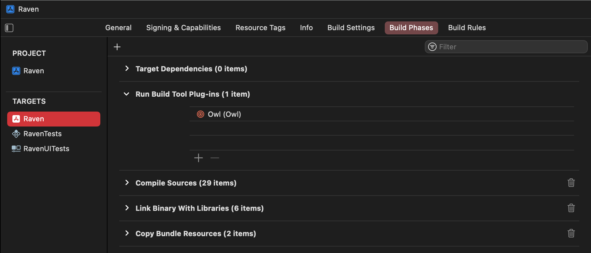

# Owl

Owl 🦉 is a command line tool that collects the licenses etc. of the Swift packages you use. It is intended to be called
during the Xcode build process.

## Installation

You can install `owl` either with Swift Package Manger[^1], [Homebrew](https://brew.sh) or
from source.

[^1]: Xcode 14 or newer

### Install with Swift Package Manager

Just add the package to your project.

```
https://github.com/qultist/owl
```

### Install with Homebrew

```shell-script
brew install qultist/formulae/owl
```

### Install from source

```shell-script
rake install
```

## Usage

Based on the installation method the usage differs. You can have a look at the [examples](Examples) to see how I'm using
the output of Owl.

### Swift Package Manager resp. Xcode Build Tool Plug-in

Starting from Xcode 14 you can add so called Build Tool Plug-ins to targets.



Owl will then create a `packages.json` file containing some information about the Swift packages and copy their license
and notice files to the bundle.

```swift
let packagesJsonUrl = Bundle.main.url(forResource: "packages", withExtension: "json", subdirectory: "Licences")!
```

### Executable

Add the following Run Script Phase to your Xcode project. Make sure that the output directory exists!

```shell-script
if which owl >/dev/null; then
  owl -b "$BUILD_DIR" -o "$SOURCE_ROOT/AwesomeProject/Resources/Licenses"
else
  echo "warning: Owl is not installed, you can download it from https://github.com/qultist/owl"
fi
```

> The `BUILD_DIR` and `SOURCE_ROOT` environment variables are provided by Xcode during build.

The output is not copied directly to the bundle, but to the specified output directory.

## License

Owl is released under the MIT license. See [LICENSE](./LICENSE) for details.
